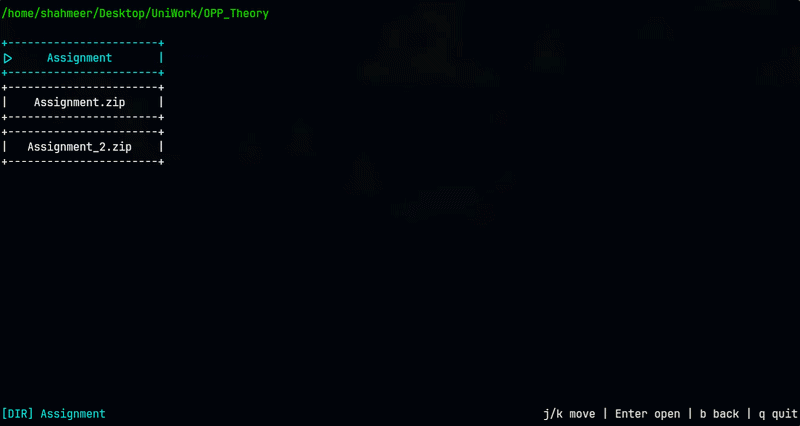

# TUI-Framework-C++
A lightweight, double-buffered Terminal User Interface (TUI) framework built from scratch in pure C++, featuring an OOP widget hierarchy and a file browser demo

# Demo File Browser


# Features

**Double-Buffered Rendering:** Eliminates terminal flickering using a custom Cell buffer with ioctl dynamic terminal sizing.

**Raw Mode Input Handling:** Bypasses canonical terminal input for real-time keystroke capture using POSIX C APIs.

**OOP Widget Architecture:** Fully modular UI system utilizing the Composite Design Pattern.

**Dynamic Layouts:** VerticalLayout and HorizontalLayout containers for automatic widget positioning without manual coordinate math.

**ANSI Color Support:** Full foreground color rendering with per-widget color control. 

# Project Structure
**Core/**  -Windows, Widget, Box, Button, Text, VertialLayout, HorizontalLayout, Container

**Terminal/** -Input (Raw mode, Terminal Control)

**main.cpp** -A demo of a file browser using the framework

**Makefile** -Build System

# How to build

**Prerequisites:** Linux, g++, make

```bash
git clone git@github.com:Muhammad-Shahmeer-404/TUI-Framework-C++
cd TUI-Framework-C++
make
./engine_test
```
# How To use File browser
**Controls:**  j/k move| Enter open| b back| q quit

# OOP Design
Widget is the abstract base class consisting of pure virtual functions `render()` and `handleInput()`. Box, Text, Button, and Container are derived classes of Widget. VerticalLayout and HorizontalLayout inherit from Container, which manages a dynamic array of Widget pointers — implementing the Composite design pattern

# Known Limitations
1. The TUI framework currently does not have a Scroll able Widget.
2. Boundary checks prevent out-of-bounds rendering but do not resize widgets dynamically.
3. The Button class has been extended with file-type awareness for the demo — in a production version this would be a derived class to keep the framework generic.
